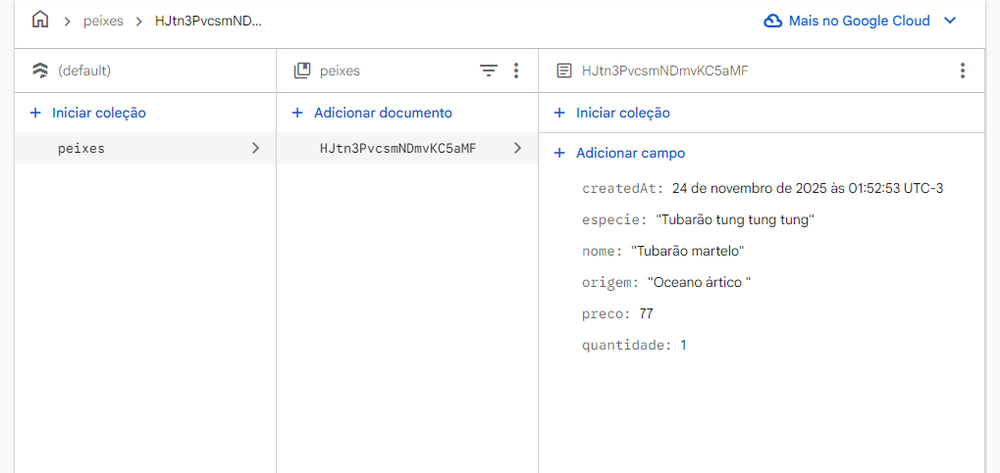
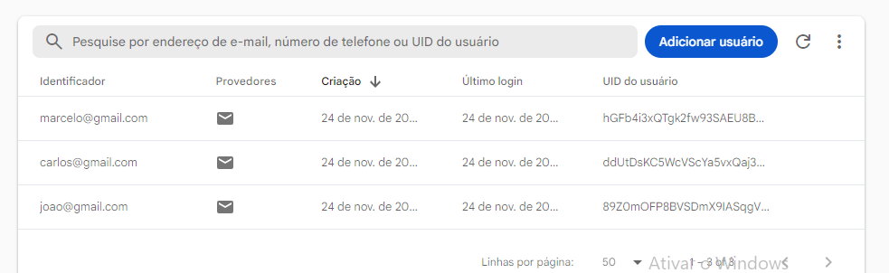

# 📘 Informações do Aplicativo

## 🐟 Storage – Exibição dos Peixes  
A tela **Storage** mostra a lista de peixes cadastrados no banco de dados.  
Ela exibe:

- Os peixes disponíveis  
- As quantidades registradas  
- As informações armazenadas no backend  

### Print da tela:

---

## 👤 Usuários – Contas Criadas  
A tela **Usuários** exibe todas as contas criadas dentro do aplicativo.  
Nela é possível visualizar:

- A lista completa de usuários  
- Os dados básicos cadastrados  
- Todas as contas existentes no sistema  

### Print da tela:

